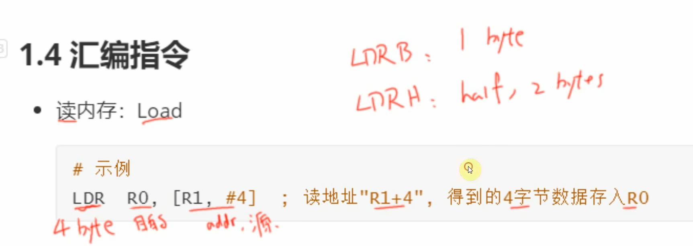

# ARM架構
講述 **ARM 處理器的 RISC（精簡指令集）架構**，大致分成兩部分：

---

## 一、文字說明

1. **ARM 芯片屬於精簡指令集計算機 (RISC: Reduced Instruction Set Computing)**
2. RISC 指令的特點：

   1. **對記憶體只有「讀」與「寫」兩種操作指令**
   2. **資料運算（例如加法、乘法）都在 CPU 內部完成**
   3. **採用 RISC 指令的 CPU 結構較為簡單，設計上更容易**

---

## 二、範例

下方的示意的是要執行

```
a = a * b
```

在 RISC 架構中，需要用到**4 條**基本的組合語言指令：

1. **讀取 a**（從記憶體把 a 載入到 CPU 暫存器）
2. **讀取 b**（同理，把 b 載入 CPU）
3. **執行乘法運算 a \* b**（在 CPU 內部完成）
4. **將運算結果寫回記憶體 a**

---


這張圖示更進一步把剛才那個 RISC 範例「a = a + b」用 ARM 指令的流程畫了出來，重點有三個部分：

---

## 一、資料與暫存器

* **記憶體 (右側)**

  * 位置 labeled `a`：內容是 `0x12`
  * 位置 labeled `b`：內容是 `0x34`
* **CPU 內部 (左側)**

  * 一組通用暫存器 R0 … R15，其中我們用到 R0、R1
  * ALU (算術邏輯單元) 處理加法運算

---

## 二、四個步驟 (與對應箭頭)

1. **① 讀取 a**

   * 指令：`LDR R0, [a]`
   * 把記憶體位址 `a` 的值 (`0x12`) 載入到 R0。
2. **② 讀取 b**

   * 指令：`LDR R1, [b]`
   * 把記憶體位址 `b` 的值 (`0x34`) 載入到 R1。
3. **③ 執行 a + b**

   * 指令：`ADD R0, R0, R1`
   * ALU 將 R0 (`0x12`) 加上 R1 (`0x34`)，結果放回 R0（此時 R0 = `0x46`）。
4. **④ 寫回記憶體 a**

   * 指令：`STR R0, [a]`
   * 把運算結果 R0 (`0x46`) 存回記憶體位置 `a`。

---

## 三、指令取用與執行流程

* 最底下的「取指令、執行」箭頭表示 CPU 的\*\*取指（fetch）→ 解碼（decode）→ 執行（execute）\*\*流程，依序跑完上面 4 條指令，就完成了把 `a` 和 `b` 相加再存回 `a` 的動作。

---

**總結**：這張示意圖說明了在 ARM RISC 架構下，如何利用「載入 (LDR) → 運算 (ADD) → 存回 (STR)」的簡單指令序列，搭配暫存器和 ALU，來實現一條高階語句 `a = a + b`。

---


這張圖示是在說明 **ARM（尤其是 Cortex-M 系列）CPU 內部的寄存器結構**，重點可以拆成三部分來理解：

---

## 1. 通用暫存器 R0…R15

* CPU 有 **16 個 32 位元的通用暫存器**：R0、R1、…、R15。
* 前 8 個（R0–R7）常稱作 **low registers**，後 5 個（R8–R12）稱作 **high registers**，都可以當作一般運算或暫存用途。

---

## 2. 特殊用途的三個寄存器

| 寄存器 |  別名 | 功能                                                  |
| :-: | :-: | :-------------------------------------------------- |
| R13 |  SP | **Stack Pointer**：堆疊指標，用於指向當前堆疊頂端地址。                |
| R14 |  LR | **Link Register**：鏈結寄存器，儲存函式呼叫返回地址。                 |
| R15 |  PC | **Program Counter**：程式計數器，儲存「下一條要執行指令」的位址。寫入新值可做跳轉。 |

* 另外圖中還畫出了 **xPSR**（Program Status Register），用來保存運算後的旗標（N/Z/C/V）及執行狀態位。

---

## 3. 兩組堆疊指標：SP\_main vs. SP\_process

Cortex-M 核心支援 **兩組堆疊指標**：

* **SP\_main**：主要由核心例行（如中斷處理）使用。
* **SP\_process**：由使用者執行緒或 RTOS 任務切換時使用。

在執行模式切換時，可以選擇讓核心自動從 main stack pointer 切換到 process stack pointer，確保中斷與主程序有各自獨立的堆疊空間。

---

**總結**：這張圖幫你快速掌握 ARM 裡 R0–R12 做一般暫存、R13/SP 管理堆疊、R14/LR 儲存返回位址、R15/PC 指示執行流程，以及 xPSR 儲存旗標；並說明 Cortex-M 又分別維護兩條堆疊指標（SP\_main、SP\_process），以利不同執行上下文使用。

---




---


